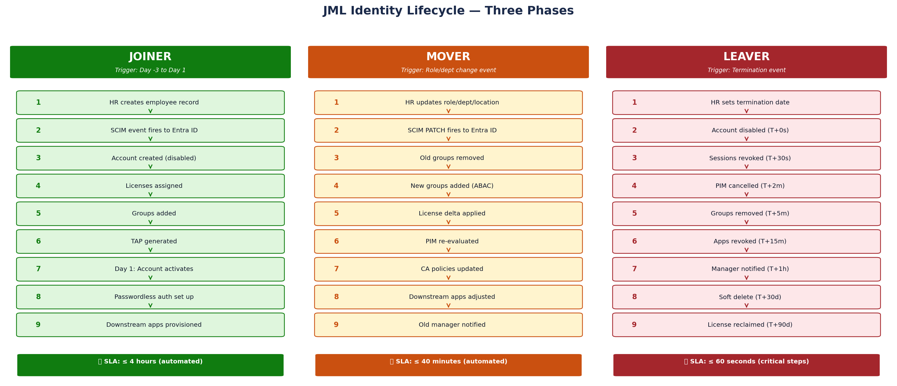
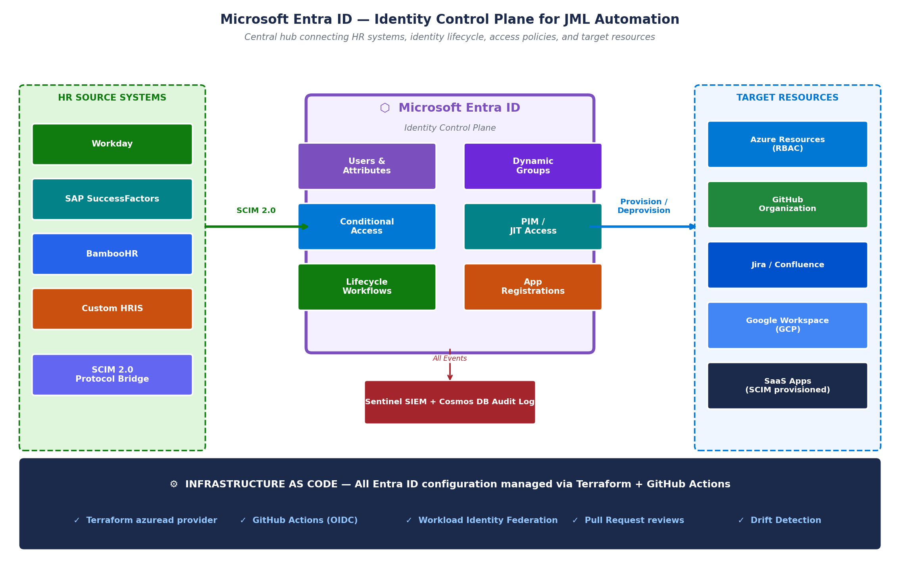
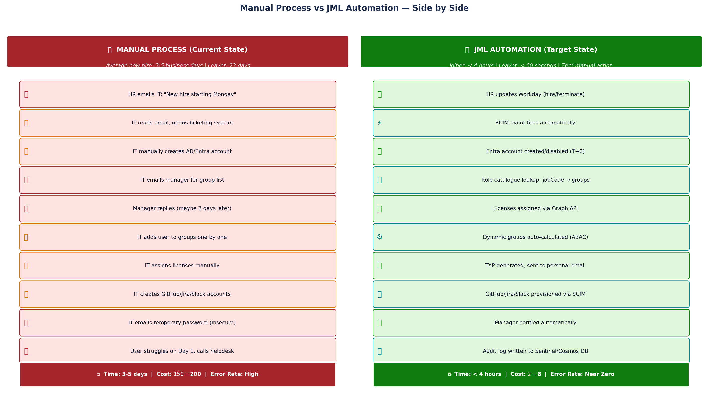
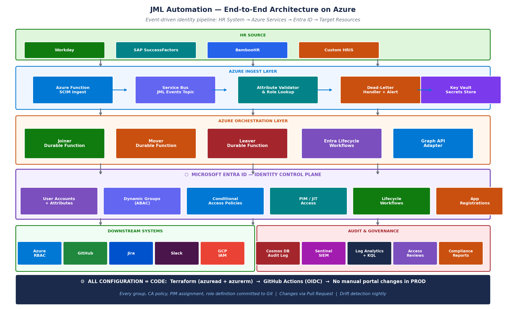
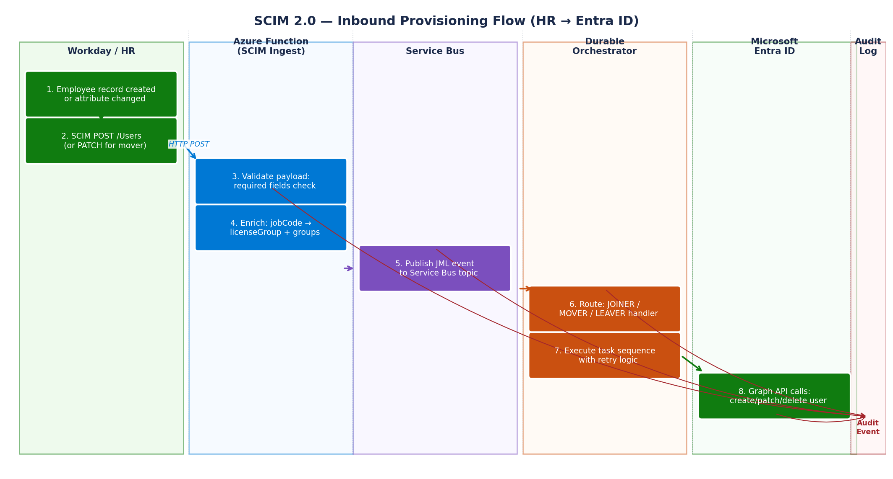
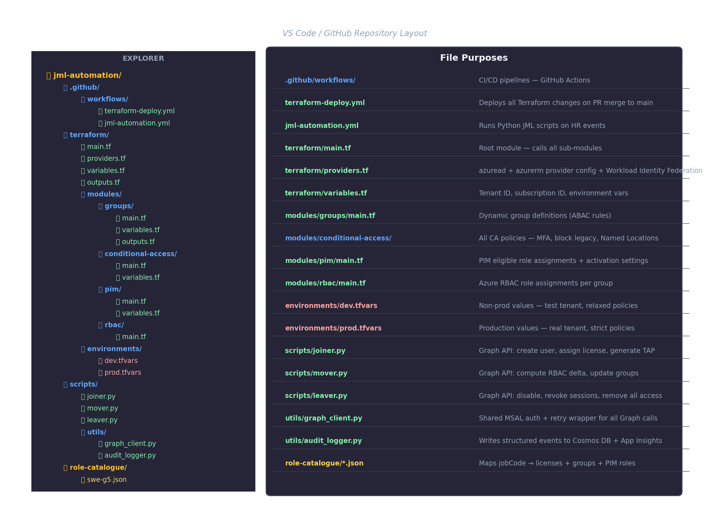
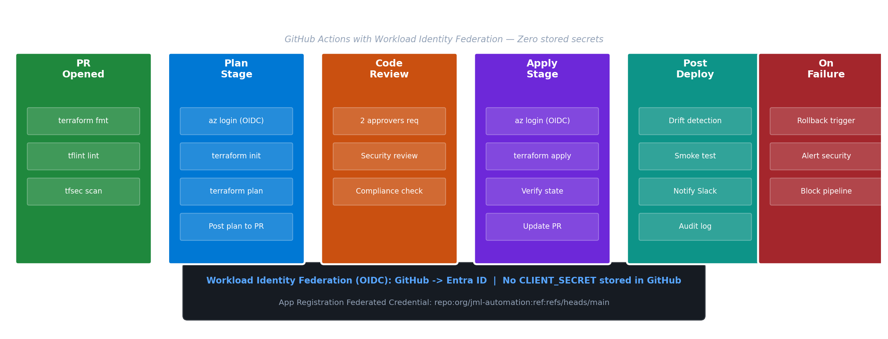
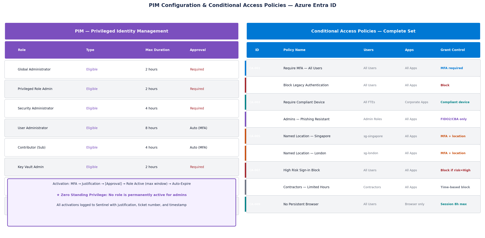

# JML Lifecycle Automation on Azure — From Manual to Zero-Touch

[](https://portal.azure.com)
[](https://registry.terraform.io/providers/hashicorp/azuread)
[](https://www.python.org)
[](https://github.com/features/actions)
[](LICENSE)

> **Author**: Mohit Kakkar | Azure Identity Architect | 15 years in Microsoft Identity & IAM  
> **Stack**: Microsoft Entra ID · Azure Functions · Terraform · Python · GitHub Actions  
> **Scope**: Production-ready JML automation — Joiner, Mover, Leaver lifecycle

---

## Table of Contents

- [What Is JML?](#1-what-is-jml)
- [Where JML Lives in Azure Entra ID](#2-where-jml-lives-in-azure-entra-id)
- [Manual Steps Today — What We Are Replacing](#3-manual-steps-today)
- [Automation Architecture](#4-automation-architecture)
- [Step-by-Step: How the Automation Works](#5-step-by-step-automation)
- [SCIM Protocol — HR to Entra ID](#6-scim-protocol)
- [Terraform Project — Complete Structure](#7-terraform-project)
- [Python Scripts — Graph API Automation](#8-python-graph-api-scripts)
- [GitHub Actions CI/CD Pipeline](#9-github-actions-cicd)
- [PIM & Conditional Access as Code](#10-pim-and-conditional-access)
- [Testing & Validation](#11-testing-and-validation)
- [Production Readiness Checklist](#12-production-readiness-checklist)

---

## 1. What Is JML?

**JML = Joiner · Mover · Leaver** — the three identity lifecycle events that every employee experiences.



| Phase | Trigger | What Must Happen | Manual SLA | Automated SLA |
|-------|---------|-----------------|-----------|---------------|
| **Joiner** | New hire created in HR system | Create account, assign licenses, configure MFA, provision apps | 2–5 business days | < 4 hours |
| **Mover** | Role/department change in HR | Recalculate RBAC, update groups, adjust CA policies | 1–3 days | < 40 minutes |
| **Leaver** | Termination entered in HR | Disable account, revoke sessions, remove all access | 3–30 days | < 60 seconds |

**The security risk of getting this wrong:**

- A single orphaned account costs an average of **$173,000** in breach remediation (IBM Cost of a Data Breach 2024)
- **80%** of breaches involve compromised credentials — the majority via stale or over-privileged accounts
- SOX, GDPR, ISO 27001, and PCI-DSS all mandate documented, timely access lifecycle controls

---

## 2. Where JML Lives in Azure Entra ID



Microsoft Entra ID is the **central identity control plane**. Before writing any code, understand the five Entra ID features that JML automation is built on:

### 2.1 Entra ID — Core Features Used

| Feature | Portal Path | Purpose in JML |
|---------|------------|----------------|
| **Lifecycle Workflows** | Entra ID > Identity Governance > Lifecycle Workflows | Native no-code/low-code Joiner/Mover/Leaver task runner |
| **SCIM Provisioning** | Entra ID > Enterprise Applications > [App] > Provisioning | Ingests HR events from Workday/SAP into Entra ID |
| **Dynamic Groups** | Entra ID > Groups > [Group] > Dynamic membership rules | ABAC — attribute-driven group membership |
| **Conditional Access** | Entra ID > Security > Conditional Access | Enforces MFA, device compliance, location policies |
| **Privileged Identity Management** | Entra ID > Identity Governance > Privileged Identity Management | Just-In-Time (JIT) access — zero standing privilege |

### 2.2 How to Navigate to JML Features in Azure Portal

**Step 1** — Open [portal.azure.com](https://portal.azure.com) and search `"Microsoft Entra ID"`

**Step 2** — Key locations:

```
Microsoft Entra ID
├── Users                          ← All user accounts, lifecycle state
├── Groups                         ← Security groups, M365 groups, dynamic rules
├── Enterprise Applications
│   └── [Your HR App]
│       └── Provisioning           ← SCIM connector to Workday/SuccessFactors
├── Identity Governance
│   ├── Lifecycle Workflows        ← Joiner/Mover/Leaver automation
│   ├── Access Reviews             ← Quarterly recertification campaigns
│   └── Privileged Identity Mgmt  ← PIM — JIT admin access
└── Security
    └── Conditional Access         ← CA Policies
```

**Step 3** — Check your license. JML automation requires:

```
Required:  Microsoft Entra ID P2  (Lifecycle Workflows, PIM, Access Reviews)
Optional:  Microsoft Entra ID Governance  (advanced Entitlement Management)
```

> **How to verify your license:**  
> Entra ID → Licenses → All Products → confirm `Microsoft Entra ID P2` or `Microsoft 365 E5`

### 2.3 Creating a User Manually (What We Will Automate)

Before automation, this is the manual portal process for a new Joiner:

**Portal path:** `Entra ID → Users → New user → Create new user`

Fields required:
```
Display name:     Sarah Chen
User principal:   s.chen@techcorp.com
Password:         Temporary (insecure — will be replaced with TAP)
Job title:        Software Engineer
Department:       Engineering
Office location:  London-UK
Manager:          Select from directory
```

**Then manually:**
1. `Users → [Sarah] → Licenses → Assign` — add M365 E3, GitHub, Jira
2. `Groups → sg-engineering → Members → Add` — add Sarah
3. `Groups → sg-london → Members → Add` — add Sarah
4. Repeat for every group (can be 10–50 groups per user)
5. Open GitHub, create account manually
6. Open Jira, create account manually
7. Email temporary password (security risk)

> **This entire sequence will be zero-touch after this implementation.**

---

## 3. Manual Steps Today



### What Gets Automated — Complete Mapping

| Manual Step Today | Automated Replacement | Technology |
|------------------|-----------------------|------------|
| HR emails IT with hire details | SCIM event fires automatically from Workday | Entra SCIM Provisioning |
| IT creates AD/Entra account | Graph API `POST /users` triggered by SCIM | Azure Durable Functions |
| IT emails manager for group list | Role Catalogue maps `jobCode → groups` | JSON Role Catalogue + Python |
| IT adds user to groups one-by-one | Dynamic group rules + Graph API batch | Terraform azuread_group (dynamic) |
| IT assigns licenses manually | `assignLicense` via Graph API | Python Graph API script |
| IT creates temporary password | Temporary Access Pass (TAP) via Graph API | Entra Lifecycle Workflow |
| IT creates GitHub/Jira accounts | SCIM provisioning to SaaS apps | Entra Enterprise App SCIM |
| IT sends email with credentials | Automated email with TAP sent to personal email | Lifecycle Workflow task |
| IT manually disables leaver account | Graph API `PATCH accountEnabled: false` at T+0s | Python Leaver Script |
| IT removes groups over days/weeks | Graph API batch group removal at T+5m | Python Leaver Script |

---

## 4. Automation Architecture



### Architecture Decision: Why These Components?

| Component | Choice | Why Not Alternative |
|-----------|--------|---------------------|
| **HR Integration** | Entra ID SCIM Provisioning (native) | Not Azure Data Factory — SCIM is the industry standard |
| **Orchestration** | Azure Durable Functions | Not Logic Apps — need retry state, code control, error handling |
| **Message Bus** | Azure Service Bus | Not Event Grid — need guaranteed delivery + dead-letter queue |
| **Identity Config** | Terraform azuread provider | Not ARM templates — declarative, version-controlled, reviewable |
| **Secrets** | Azure Key Vault + Managed Identity | Never client secrets in code or env vars |
| **Auth (CI/CD)** | Workload Identity Federation (OIDC) | No stored `CLIENT_SECRET` in GitHub — zero secret rotation risk |

---

## 5. Step-by-Step Automation

### 5.1 Joiner Flow — Detailed



```
Day -3, 09:00  HR creates employee record in Workday
Day -3, 09:05  SCIM event hits Azure Function (SCIM Ingest)
Day -3, 09:05  Attribute validation: firstName, lastName, jobCode, officeLocation, hireDate
Day -3, 09:05  Role Catalogue lookup: jobCode SWE-G5 → licenseGroup, securityGroups, pimRoles
Day -3, 09:06  Service Bus message published: topic=jml-events, type=JOINER
Day -3, 09:06  Durable Function: Joiner Orchestrator starts
Day -3, 09:07  Graph API: POST /users → account created (accountEnabled: false)
Day -3, 09:07  Graph API: POST /users/{id}/assignLicense (M365 E3, GitHub, Jira)
Day -3, 09:08  Entra: Dynamic group evaluation (sg-engineering, sg-london added automatically)
Day -3, 09:09  Graph API: POST temporaryAccessPassMethods (TAP, valid 72h from hireDate)
Day -3, 09:09  Lifecycle Workflow: Send welcome email to personal email (TAP + Day 1 guide)
Day -3, 09:10  Graph API: GitHub SCIM endpoint → add to org + team
Day -3, 09:10  Graph API: Jira SCIM endpoint → create account + project role
Day -3, 09:10  Cosmos DB: Write audit event JOINER_PROVISIONED
Day 1, 07:00   Lifecycle Workflow: accountEnabled → true (hire date trigger)
Day 1, 08:30   Employee uses TAP → registers FIDO2 key → passwordless from Day 1
```

### 5.2 Mover Flow — Detailed

```
Trigger: HR updates jobCode SWE-G5 → SWE-G7, officeLocation London → Singapore

T+0m   SCIM PATCH fires: { jobTitle, jobCode, officeLocation, managerId changed }
T+1m   SCIM Ingest Function receives PATCH payload
T+2m   Role Catalogue delta computed:
         Groups to ADD:    sg-swe-g7, sg-singapore
         Groups to REMOVE: sg-swe-g5, sg-london
T+3m   Graph API: remove from sg-swe-g5 and sg-london
T+5m   Dynamic group re-evaluation: sg-swe-g7 and sg-singapore auto-joined (ABAC)
T+8m   PIM delta: SWE-G7 gets eligible role 'prod-deploy-contributor'
T+10m  CA Policy: Singapore Named Location policy applied to user account
T+12m  Notification: Old manager + new manager receive automated email
T+30d  Access Review triggered: validate no residual London-specific access
```

### 5.3 Leaver Flow — Detailed (Security Critical)

```
Trigger: HR sets employeeLeaveDateTime = today (termination entered)

T+0s    SCIM DELETE fires from Workday
T+0s    Leaver Orchestrator starts — IMMEDIATE ACTIONS BEGIN
T+5s    Graph API PATCH /users/{id}: { accountEnabled: false }
         → Account disabled. Employee cannot log in to ANY system.
T+30s   Graph API POST /users/{id}/revokeSignInSessions
         → All tokens invalidated. Logged out of: laptop, phone, Teams, GitHub.
T+2m    Graph API: Cancel all active PIM role activations
T+5m    Graph API: Remove from all security groups (batch, all memberships)
T+10m   Graph API: Remove all license assignments
T+15m   GitHub/Jira/Slack: SCIM deprovision via Enterprise App connectors
T+1h    Logic App: Manager notification (file ownership list, OneDrive 30d link)
T+1h    ServiceNow ticket: Hardware collection request (laptop, FIDO2 key)
T+30d   Graph API: softDelete user object
T+90d   Graph API: permanentDelete + license reclaimed
```

---

## 6. SCIM Protocol

The System for Cross-domain Identity Management (SCIM 2.0, RFC 7644) is the protocol that moves identity events from your HR system into Entra ID.

### 6.1 Configure SCIM in Entra ID (Portal Steps)

**Portal path:** `Entra ID → Enterprise Applications → + New application → Create your own application`

For Workday:
```
Entra ID → Enterprise Applications → Workday → Provisioning
→ Provisioning Mode: Automatic
→ Admin Credentials:
    Tenant URL: https://wd3-impl-services1.workday.com/ccx/service/tenantname/Human_Resources/v34.0
    Secret Token: [Workday Integration Token]
→ Attribute Mappings → Customize
```

**Critical attribute mappings to configure:**

| Workday Attribute | Entra ID Attribute | Note |
|------------------|--------------------|------|
| `Worker_ID` | `employeeId` | Immutable — never changes |
| `Legal_Name_Given_Name` | `givenName` | |
| `Legal_Name_Family_Name` | `surname` | |
| `Business_Title` | `jobTitle` | |
| `Organization_Name` | `department` | |
| `Job_Profile_Name` | `extensionAttribute1` | Maps to role catalogue |
| `Work_Email` | `mail` | |
| `Personal_Email` | `extensionAttribute2` | PII — used for TAP delivery |
| `Worker_Start_Date` | `employeeHireDate` | Triggers Lifecycle Workflow |
| `Termination_Date` | `employeeLeaveDateTime` | Triggers Leaver workflow |

### 6.2 SCIM Payload Examples

**Joiner SCIM POST:**
```json
{
  "schemas": ["urn:ietf:params:scim:schemas:core:2.0:User"],
  "userName": "s.chen@techcorp.com",
  "name": {
    "givenName": "Sarah",
    "familyName": "Chen"
  },
  "emails": [
    { "value": "s.chen@techcorp.com", "type": "work", "primary": true },
    { "value": "sarah.personal@gmail.com", "type": "home" }
  ],
  "urn:ietf:params:scim:schemas:extension:enterprise:2.0:User": {
    "department": "Engineering",
    "manager": { "value": "EMP-1042" }
  },
  "urn:techcorp:scim:schema:1.0:User": {
    "jobCode": "SWE-G5",
    "officeLocation": "London-UK",
    "employeeHireDate": "2026-03-03",
    "employeeType": "FTE"
  },
  "active": false
}
```

**Mover SCIM PATCH:**
```json
{
  "schemas": ["urn:ietf:params:scim:api:messages:2.0:PatchOp"],
  "Operations": [
    { "op": "replace", "path": "title", "value": "Senior Software Engineer" },
    { "op": "replace", "path": "urn:techcorp:scim:schema:1.0:User:jobCode", "value": "SWE-G7" },
    { "op": "replace", "path": "urn:techcorp:scim:schema:1.0:User:officeLocation", "value": "Singapore-SG" },
    { "op": "replace", "path": "urn:ietf:params:scim:schemas:extension:enterprise:2.0:User:manager.value", "value": "EMP-2087" }
  ]
}
```

**Leaver SCIM DELETE:**
```
DELETE https://graph.microsoft.com/v1.0/servicePrincipals/{spId}/synchronization/jobs/{jobId}/...
Body: { "schemas": ["urn:ietf:params:scim:api:messages:2.0:PatchOp"], "Operations": [{ "op": "replace", "path": "active", "value": false }] }
```

---

## 7. Terraform Project



### 7.1 Full Project Structure

```
jml-automation/
├── .github/
│   └── workflows/
│       ├── terraform-deploy.yml      # Deploys Terraform on PR merge
│       └── jml-automation.yml        # Runs Python scripts on HR events
├── terraform/
│   ├── main.tf                       # Root module
│   ├── providers.tf                  # azuread + azurerm + Workload Identity
│   ├── variables.tf                  # Tenant ID, subscription, environment
│   ├── outputs.tf                    # Group IDs, app IDs for downstream use
│   ├── modules/
│   │   ├── groups/
│   │   │   ├── main.tf              # Dynamic group definitions (ABAC)
│   │   │   ├── variables.tf
│   │   │   └── outputs.tf
│   │   ├── conditional-access/
│   │   │   ├── main.tf              # All CA policies
│   │   │   ├── variables.tf
│   │   │   └── outputs.tf
│   │   ├── pim/
│   │   │   ├── main.tf              # PIM eligible assignments
│   │   │   ├── variables.tf
│   │   │   └── outputs.tf
│   │   └── rbac/
│   │       ├── main.tf              # Azure RBAC role assignments
│   │       ├── variables.tf
│   │       └── outputs.tf
│   └── environments/
│       ├── dev.tfvars               # Non-prod values
│       └── prod.tfvars              # Production values
├── scripts/
│   ├── joiner.py                    # Graph API: full joiner provisioning
│   ├── mover.py                     # Graph API: RBAC delta calculation
│   ├── leaver.py                    # Graph API: full de-provisioning
│   └── utils/
│       ├── graph_client.py          # MSAL auth + retry wrapper
│       └── audit_logger.py          # Cosmos DB + App Insights logging
├── role-catalogue/
│   ├── swe-g5.json                  # jobCode → licenses + groups + PIM
│   └── swe-g7.json
└── README.md
```

### 7.2 `terraform/providers.tf`

> Configures the `azuread` and `azurerm` providers.  
> **Key:** Uses `use_oidc = true` — no client secret. Authentication via Workload Identity Federation from GitHub Actions.

```hcl
# terraform/providers.tf

terraform {
  required_version = ">= 1.6.0"

  required_providers {
    azuread = {
      source  = "hashicorp/azuread"
      version = "~> 2.47"
    }
    azurerm = {
      source  = "hashicorp/azurerm"
      version = "~> 3.90"
    }
  }

  # Remote state — prevents concurrent apply conflicts
  backend "azurerm" {
    resource_group_name  = "rg-terraform-state"
    storage_account_name = "stterraformstateprod"
    container_name       = "tfstate"
    key                  = "jml-automation.tfstate"
    # Authenticated via OIDC from GitHub Actions — no SAS token in code
    use_oidc = true
  }
}

# azuread provider — Entra ID resources (users, groups, CA, PIM, App Regs)
provider "azuread" {
  tenant_id = var.tenant_id
  use_oidc  = true   # GitHub Actions authenticates via OIDC token — no client_secret
}

# azurerm provider — Azure resource RBAC assignments
provider "azurerm" {
  subscription_id = var.subscription_id
  use_oidc        = true
  features {}
}
```

### 7.3 `terraform/variables.tf`

```hcl
# terraform/variables.tf

variable "tenant_id" {
  type        = string
  description = "Microsoft Entra ID Tenant ID"
}

variable "subscription_id" {
  type        = string
  description = "Azure Subscription ID"
}

variable "environment" {
  type        = string
  description = "Environment: dev | staging | prod"
  validation {
    condition     = contains(["dev", "staging", "prod"], var.environment)
    error_message = "Environment must be dev, staging, or prod."
  }
}

variable "break_glass_accounts" {
  type        = list(string)
  description = "Break-glass account UPNs — excluded from ALL Conditional Access policies"
  sensitive   = true
}

variable "named_locations" {
  type = map(object({
    ip_ranges = list(string)
  }))
  description = "Named Locations for Conditional Access (office IP ranges)"
  default = {}
}
```

### 7.4 `terraform/main.tf`

> Root module that calls all sub-modules. Passing outputs between modules (e.g., group IDs → PIM assignments) keeps the config DRY.

```hcl
# terraform/main.tf

# Data source: current tenant info
data "azuread_client_config" "current" {}

# ── Module: Groups ──────────────────────────────────────────────────────────
# Creates all security groups used in JML automation.
# Dynamic groups use ABAC rules — membership is automatic based on user attributes.
module "groups" {
  source = "./modules/groups"

  environment = var.environment
}

# ── Module: Conditional Access ───────────────────────────────────────────────
# Deploys all CA policies. No CA policy should ever be created manually.
# break_glass_accounts are excluded from all policies — emergency access.
module "conditional_access" {
  source = "./modules/conditional-access"

  environment          = var.environment
  break_glass_group_id = module.groups.break_glass_group_id
  named_locations      = var.named_locations
}

# ── Module: PIM ───────────────────────────────────────────────────────────────
# Creates PIM eligible assignments for all privileged roles.
# Groups are used as PIM principals — individual user assignments are not used.
module "pim" {
  source = "./modules/pim"

  subscription_id         = var.subscription_id
  swe_g7_group_id         = module.groups.swe_g7_group_id
  security_admin_group_id = module.groups.security_admin_group_id
}

# ── Module: RBAC ─────────────────────────────────────────────────────────────
# Azure subscription RBAC — what Azure resources each group can access.
module "rbac" {
  source = "./modules/rbac"

  subscription_id     = var.subscription_id
  engineering_group_id = module.groups.engineering_group_id
}
```

### 7.5 `terraform/modules/groups/main.tf`

> **ABAC Pattern:** Instead of adding users to groups manually, dynamic membership rules evaluate user attributes automatically.  
> When Sarah's `jobTitle` changes to "Senior Software Engineer", she joins `sg-swe-g7` automatically — zero admin action.

```hcl
# terraform/modules/groups/main.tf

# ── Engineering base group ────────────────────────────────────────────────────
# All FTE engineers — static assignments managed by JML scripts, not portal
resource "azuread_group" "engineering" {
  display_name     = "sg-engineering"
  description      = "All FTE engineering staff — base group for Entra ID governance"
  security_enabled = true
  mail_enabled     = false

  lifecycle {
    ignore_changes = [members]  # Members managed by JML automation, not Terraform
  }
}

# ── Dynamic group: SWE Grade 7 (ABAC) ────────────────────────────────────────
# Rule evaluates automatically when user attributes change in Entra ID.
# This is Attribute-Based Access Control (ABAC) — no manual group management needed.
resource "azuread_group" "swe_g7" {
  display_name     = "sg-swe-g7"
  description      = "Senior Software Engineers Grade 7 — PIM prod-deploy eligible"
  security_enabled = true
  mail_enabled     = false
  types            = ["DynamicMembership"]   # Enables dynamic rule evaluation

  dynamic_membership {
    enabled = true
    # Rule syntax: user attribute path, operator, value
    # Combined with 'and' for multiple conditions
    rule = "(user.jobTitle -eq \"Senior Software Engineer\") and (user.employeeType -eq \"Member\")"
    # 'Member' = FTE in Entra ID. 'Guest' = external. Contractors use separate rule.
  }
}

# ── Dynamic group: SWE Grade 5 ────────────────────────────────────────────────
resource "azuread_group" "swe_g5" {
  display_name     = "sg-swe-g5"
  security_enabled = true
  mail_enabled     = false
  types            = ["DynamicMembership"]

  dynamic_membership {
    enabled = true
    rule    = "(user.jobTitle -eq \"Software Engineer\") and (user.employeeType -eq \"Member\")"
  }
}

# ── Location-based dynamic groups ────────────────────────────────────────────
# Membership auto-updates when an employee moves offices (Mover scenario).
resource "azuread_group" "london" {
  display_name     = "sg-london"
  security_enabled = true
  mail_enabled     = false
  types            = ["DynamicMembership"]

  dynamic_membership {
    enabled = true
    # extensionAttribute3 stores normalized office location — set by SCIM ingest function
    rule = "user.extensionAttribute3 -eq \"London-UK\""
  }
}

resource "azuread_group" "singapore" {
  display_name     = "sg-singapore"
  security_enabled = true
  mail_enabled     = false
  types            = ["DynamicMembership"]

  dynamic_membership {
    enabled = true
    rule = "user.extensionAttribute3 -eq \"Singapore-SG\""
  }
}

# ── Break glass group ─────────────────────────────────────────────────────────
# Emergency access accounts. EXCLUDED from all CA policies.
# Contains max 2 accounts. Passwords stored in physical safe.
resource "azuread_group" "break_glass" {
  display_name     = "sg-break-glass"
  description      = "Emergency access accounts — excluded from all CA policies. Audit quarterly."
  security_enabled = true
  mail_enabled     = false
}

# ── Contractor group ──────────────────────────────────────────────────────────
resource "azuread_group" "contractors" {
  display_name     = "sg-contractors"
  security_enabled = true
  mail_enabled     = false
  types            = ["DynamicMembership"]

  dynamic_membership {
    enabled = true
    # userType -eq "Guest" catches external B2B accounts
    # extensionAttribute4 stores employeeType from HR system
    rule = "user.extensionAttribute4 -eq \"Contractor\""
  }
}
```

### 7.6 `terraform/modules/groups/outputs.tf`

```hcl
# terraform/modules/groups/outputs.tf
# Group IDs are passed to PIM and RBAC modules — no hardcoding of IDs

output "engineering_group_id"    { value = azuread_group.engineering.object_id }
output "swe_g7_group_id"         { value = azuread_group.swe_g7.object_id }
output "swe_g5_group_id"         { value = azuread_group.swe_g5.object_id }
output "london_group_id"         { value = azuread_group.london.object_id }
output "singapore_group_id"      { value = azuread_group.singapore.object_id }
output "break_glass_group_id"    { value = azuread_group.break_glass.object_id }
output "contractors_group_id"    { value = azuread_group.contractors.object_id }
output "security_admin_group_id" { value = azuread_group.security_admins.object_id }
```

### 7.7 `terraform/modules/conditional-access/main.tf`

> **Every CA policy is code.** No policy should exist in the portal that is not in this file.  
> The `state = "enabled"` line is the deployment gate — set to `"enabledForReportingButNotEnforced"` in dev.

```hcl
# terraform/modules/conditional-access/main.tf

locals {
  # CA policies use "report-only" in dev, "enabled" in prod
  ca_state = var.environment == "prod" ? "enabled" : "enabledForReportingButNotEnforced"
}

# ── CA-001: Require MFA — All Users ──────────────────────────────────────────
# The foundational policy. Every user, every app, every access must satisfy MFA.
resource "azuread_conditional_access_policy" "require_mfa_all" {
  display_name = "CA-001-Require-MFA-All-Users-${var.environment}"
  state        = local.ca_state

  conditions {
    users {
      included_users  = ["All"]
      excluded_groups = [var.break_glass_group_id]  # Never lock out emergency access
    }
    applications {
      included_applications = ["All"]
    }
    client_app_types = ["browser", "mobileAppsAndDesktopClients"]
  }

  grant_controls {
    operator          = "OR"
    built_in_controls = ["mfa"]
  }
}

# ── CA-002: Block Legacy Authentication ───────────────────────────────────────
# Legacy auth (SMTP, POP3, IMAP, Basic Auth) cannot satisfy MFA.
# This single policy eliminates the #1 vector for password spray attacks.
resource "azuread_conditional_access_policy" "block_legacy_auth" {
  display_name = "CA-002-Block-Legacy-Authentication-${var.environment}"
  state        = local.ca_state

  conditions {
    users {
      included_users  = ["All"]
      excluded_groups = [var.break_glass_group_id]
    }
    applications {
      included_applications = ["All"]
    }
    # These client app types cannot perform modern auth
    client_app_types = ["exchangeActiveSync", "other"]
  }

  grant_controls {
    operator          = "OR"
    built_in_controls = ["block"]
  }
}

# ── CA-003: Require Compliant Device — Corporate Apps ─────────────────────────
# All FTE users accessing corporate apps must use an Intune-enrolled device.
# Contractors are excluded — they use their own devices with app protection policy.
resource "azuread_conditional_access_policy" "require_compliant_device" {
  display_name = "CA-003-Require-Compliant-Device-FTE-${var.environment}"
  state        = local.ca_state

  conditions {
    users {
      included_users  = ["All"]
      excluded_groups = [
        var.break_glass_group_id,
        var.contractors_group_id   # Contractors use MAM policy instead
      ]
    }
    applications {
      # Target specific high-value apps — not "All" to avoid blocking helpdesk tools
      included_applications = [
        "00000002-0000-0ff1-ce00-000000000000",   # Exchange Online
        "00000003-0000-0ff1-ce00-000000000000",   # SharePoint Online
      ]
    }
    client_app_types = ["mobileAppsAndDesktopClients"]
  }

  grant_controls {
    operator          = "AND"
    built_in_controls = ["mfa", "compliantDevice"]
  }
}

# ── CA-004: Admins — Phishing-Resistant MFA Only ─────────────────────────────
# Any user with admin roles must use FIDO2 or Certificate-Based Auth.
# Standard authenticator app is not sufficient for admin actions.
resource "azuread_conditional_access_policy" "admins_phishing_resistant" {
  display_name = "CA-004-Admins-Phishing-Resistant-MFA-${var.environment}"
  state        = local.ca_state

  conditions {
    users {
      included_roles = [
        "62e90394-69f5-4237-9190-012177145e10",  # Global Administrator
        "194ae4cb-b126-40b2-bd5b-6091b380977d",  # Security Administrator
        "f28a1f50-f6e7-4571-818b-6a12f2af6b6c",  # SharePoint Administrator
      ]
      excluded_groups = [var.break_glass_group_id]
    }
    applications {
      included_applications = ["All"]
    }
    client_app_types = ["all"]
  }

  grant_controls {
    operator = "OR"
    # authenticationStrength enforces FIDO2 or CBA — not TOTP or push notification
    authentication_strength_policy_id = azuread_authentication_strength_policy.phishing_resistant.id
  }
}

# ── Authentication Strength: Phishing-Resistant ───────────────────────────────
resource "azuread_authentication_strength_policy" "phishing_resistant" {
  display_name = "Phishing-Resistant-MFA"
  description  = "Requires FIDO2 Security Key or Certificate-Based Authentication"
  # allowed_combinations: what satisfies this strength
  allowed_combinations = [
    "fido2",                # FIDO2 security key (YubiKey, etc.)
    "windowsHelloForBusiness",  # Windows Hello for Business
    "x509CertificateMultiFactor" # Certificate-based auth (smart cards)
  ]
}

# ── CA-005: Named Location — Singapore ───────────────────────────────────────
# Users in the Singapore group must access from Singapore IP range OR satisfy MFA.
# This prevents credential stuffing from unexpected geolocations.
resource "azuread_conditional_access_policy" "named_location_singapore" {
  display_name = "CA-005-Named-Location-Singapore-${var.environment}"
  state        = local.ca_state

  conditions {
    users {
      included_groups = [var.singapore_group_id]
      excluded_groups = [var.break_glass_group_id]
    }
    applications {
      included_applications = ["All"]
    }
    locations {
      included_locations = ["All"]
      excluded_locations = [
        azuread_named_location.singapore_office.id,
        "AllTrusted"
      ]
    }
    client_app_types = ["all"]
  }

  grant_controls {
    operator          = "OR"
    built_in_controls = ["mfa"]
  }
}

# Named location: Singapore office IP range
resource "azuread_named_location" "singapore_office" {
  display_name = "Singapore Office - Marina Bay"
  ip {
    ip_ranges = var.named_locations["singapore"].ip_ranges
    trusted   = true
  }
}
```

### 7.8 `terraform/modules/pim/main.tf`

> **PIM eligible assignments** give groups the *right* to activate a role — not a permanent active assignment.  
> The `schedule` block sets the maximum duration an activation can last.

```hcl
# terraform/modules/pim/main.tf

data "azurerm_subscription" "primary" {
  subscription_id = var.subscription_id
}

data "azurerm_role_definition" "contributor" {
  name  = "Contributor"
  scope = data.azurerm_subscription.primary.id
}

data "azurerm_role_definition" "key_vault_admin" {
  name  = "Key Vault Administrator"
  scope = data.azurerm_subscription.primary.id
}

# ── PIM Eligible: SWE-G7 → Contributor (Production Deploy) ───────────────────
# SWE-G7 engineers CAN activate Contributor on the subscription.
# They do NOT have Contributor permanently — only JIT for max 4 hours.
# Activation requires: MFA + business justification (ticket number).
resource "azurerm_pim_eligible_role_assignment" "swe_g7_contributor" {
  scope              = data.azurerm_subscription.primary.id
  role_definition_id = data.azurerm_role_definition.contributor.id
  principal_id       = var.swe_g7_group_id

  schedule {
    start_date_time = "2026-01-01T00:00:00Z"
    expiration {
      # No end date = permanent eligibility (but never permanent activation)
      duration_type  = "NoExpiration"
    }
  }

  justification = "SWE-G7 production deployment capability — security policy SEC-042"

  ticket {
    number = "INC-JML-001"
    system = "ServiceNow"
  }
}

# ── PIM Eligible: Security Admins → Key Vault Admin ──────────────────────────
# Max activation: 2 hours. Requires explicit approval from Global Admin.
resource "azurerm_pim_eligible_role_assignment" "security_admin_kv" {
  scope              = data.azurerm_subscription.primary.id
  role_definition_id = data.azurerm_role_definition.key_vault_admin.id
  principal_id       = var.security_admin_group_id

  schedule {
    start_date_time = "2026-01-01T00:00:00Z"
    expiration {
      duration_type  = "NoExpiration"
    }
  }

  justification = "Security team Key Vault access for secret rotation — requires approval"
}

# ── Entra ID PIM: Role Settings (activation requirements) ────────────────────
# Sets the RULES for how a role can be activated — MFA, approval, max duration.
resource "azuread_privileged_access_group_eligibility_schedule" "swe_g7_schedule" {
  group_id        = var.swe_g7_group_id
  principal_id    = var.swe_g7_group_id
  assignment_type = "member"

  start_date      = "2026-01-01T00:00:00Z"
  duration        = "P0D"   # No expiry for the eligible assignment itself
}
```

### 7.9 `terraform/environments/prod.tfvars`

```hcl
# terraform/environments/prod.tfvars
# Do NOT commit real tenant IDs to source control.
# These values are injected by GitHub Actions from repository secrets.

tenant_id       = "YOUR_TENANT_ID"        # Injected by GitHub Actions
subscription_id = "YOUR_SUBSCRIPTION_ID"  # Injected by GitHub Actions
environment     = "prod"

break_glass_accounts = []  # Injected from GitHub Actions secrets — never in code

named_locations = {
  singapore = {
    ip_ranges = ["203.0.113.0/24"]   # Replace with real Singapore office egress IP
  }
  london = {
    ip_ranges = ["198.51.100.0/24"]  # Replace with real London office egress IP
  }
}
```

### 7.10 `role-catalogue/swe-g5.json`

> The Role Catalogue is the decision engine. Every `jobCode` maps to an exact set of licenses, groups, and PIM roles.  
> When the SCIM Ingest Function receives a new Joiner, it looks up this file to know exactly what to provision.

```json
{
  "jobCode": "SWE-G5",
  "displayName": "Software Engineer Grade 5",
  "employeeType": "FTE",
  "licenses": [
    { "skuId": "ENTERPRISEPACK", "displayName": "Microsoft 365 E3" },
    { "skuId": "GitHub_Enterprise_Cloud", "displayName": "GitHub Enterprise Cloud" },
    { "skuId": "Jira_Software_Cloud", "displayName": "Jira Software Cloud" }
  ],
  "staticGroups": [
    "sg-engineering",
    "sg-fte"
  ],
  "dynamicGroups": [
    "sg-swe-g5",
    "sg-{officeLocation}"
  ],
  "pimEligibleRoles": [],
  "conditionalAccessProfiles": [
    "CA-001-Require-MFA-All-Users",
    "CA-002-Block-Legacy-Authentication",
    "CA-003-Require-Compliant-Device-FTE"
  ],
  "maxAccessReviewCycleDays": 90,
  "tapValidHours": 72
}
```

---

## 8. Python Graph API Scripts

### 8.1 `scripts/utils/graph_client.py`

> Shared authentication client used by all three JML scripts.  
> Uses **Managed Identity** when running in Azure — no credentials in code.  
> Falls back to environment variables for local development.

```python
# scripts/utils/graph_client.py

import os
import time
import logging
import requests
from typing import Any, Dict, Optional

import msal
from azure.identity import ManagedIdentityCredential, DefaultAzureCredential
from azure.keyvault.secrets import SecretClient

logger = logging.getLogger(__name__)
GRAPH_BASE = "https://graph.microsoft.com/v1.0"


class GraphClient:
    """
    Authenticated Microsoft Graph API client.
    
    Auth priority:
    1. Managed Identity (when running in Azure Functions/Container)
    2. DefaultAzureCredential (local dev — uses az login or env vars)
    
    All methods include automatic retry on 429 (throttling) and 503 (service unavailable).
    """

    def __init__(self, tenant_id: str, keyvault_url: Optional[str] = None):
        self.tenant_id = tenant_id
        self._token: Optional[str] = None
        self._token_expiry: float = 0
        self._session = requests.Session()
        self._session.headers.update({"Content-Type": "application/json"})

    def _get_token(self) -> str:
        """Get access token. Refreshes automatically when within 5 minutes of expiry."""
        if self._token and time.time() < self._token_expiry - 300:
            return self._token

        try:
            # Managed Identity — works in Azure Functions, Container Apps, VMs
            credential = ManagedIdentityCredential()
            token_obj = credential.get_token("https://graph.microsoft.com/.default")
            self._token = token_obj.token
            self._token_expiry = token_obj.expires_on
        except Exception:
            # Fallback for local development — uses az login or service principal env vars
            credential = DefaultAzureCredential()
            token_obj = credential.get_token("https://graph.microsoft.com/.default")
            self._token = token_obj.token
            self._token_expiry = time.time() + 3600

        return self._token

    def _request(self, method: str, path: str, **kwargs) -> requests.Response:
        """Execute a Graph API request with retry logic for throttling."""
        url = f"{GRAPH_BASE}{path}"
        max_retries = 3

        for attempt in range(max_retries):
            self._session.headers["Authorization"] = f"Bearer {self._get_token()}"

            response = self._session.request(method, url, **kwargs)

            if response.status_code == 429:
                # Graph API rate limit — respect the Retry-After header
                retry_after = int(response.headers.get("Retry-After", 30))
                logger.warning(f"Graph API throttled. Retrying after {retry_after}s")
                time.sleep(retry_after)
                continue

            if response.status_code in (500, 503) and attempt < max_retries - 1:
                time.sleep(2 ** attempt)  # Exponential backoff: 1s, 2s, 4s
                continue

            return response

        response.raise_for_status()

    def get(self, path: str, params: Dict = None) -> Dict:
        r = self._request("GET", path, params=params)
        r.raise_for_status()
        return r.json()

    def post(self, path: str, json: Dict = None) -> Dict:
        r = self._request("POST", path, json=json)
        r.raise_for_status()
        return r.json() if r.content else {}

    def patch(self, path: str, json: Dict) -> None:
        r = self._request("PATCH", path, json=json)
        r.raise_for_status()

    def delete(self, path: str) -> None:
        r = self._request("DELETE", path)
        if r.status_code not in (200, 204, 404):  # 404 = already deleted — idempotent
            r.raise_for_status()

    def get_user_id(self, upn: str) -> str:
        """Resolve UPN to Entra Object ID."""
        result = self.get(f"/users/{upn}")
        return result["id"]

    def get_user_groups(self, user_id: str) -> list[str]:
        """Get all group IDs the user is a member of."""
        result = self.get(
            f"/users/{user_id}/memberOf",
            params={"$select": "id,displayName", "$top": 999}
        )
        return [g["id"] for g in result.get("value", [])
                if g.get("@odata.type") == "#microsoft.graph.group"]
```

### 8.2 `scripts/joiner.py`

```python
# scripts/joiner.py
# Full Joiner provisioning — called by Azure Durable Function Orchestrator

import json
import logging
from datetime import datetime, timezone
from pathlib import Path

from utils.graph_client import GraphClient
from utils.audit_logger import AuditLogger

logger = logging.getLogger(__name__)
CATALOGUE_DIR = Path(__file__).parent.parent / "role-catalogue"


class JoinerProvisioner:
    """
    Provisions a new Joiner in Microsoft Entra ID.
    
    Triggered by: SCIM POST /Users from HR system
    Idempotent: safe to re-run if partially completed (all steps check before acting)
    """

    def __init__(self, graph: GraphClient, audit: AuditLogger):
        self.graph = graph
        self.audit = audit

    def execute(self, scim_payload: dict, correlation_id: str) -> dict:
        upn = scim_payload["userName"]
        job_code = scim_payload.get("urn:techcorp:scim:schema:1.0:User", {}).get("jobCode")
        personal_email = next(
            (e["value"] for e in scim_payload.get("emails", []) if e.get("type") == "home"),
            None
        )

        logger.info(f"[{correlation_id}] Starting Joiner provisioning for {upn}")

        # Load role catalogue for this job code
        catalogue = self._load_catalogue(job_code)
        results = {"upn": upn, "correlation_id": correlation_id, "steps": {}}

        # ── Step 1: Create Entra ID account ─────────────────────────────────
        # Account is created DISABLED — will be enabled on employeeHireDate
        user_id = self._create_or_get_user(scim_payload, results)

        # ── Step 2: Assign licenses ──────────────────────────────────────────
        # Licenses are assigned from the role catalogue — not configured manually
        self._assign_licenses(user_id, catalogue["licenses"], results)

        # ── Step 3: Add to static groups ─────────────────────────────────────
        # Dynamic groups (sg-swe-g5, sg-london) are handled automatically by Entra
        # Only static groups (sg-engineering, sg-fte) need Graph API calls
        self._add_to_static_groups(user_id, catalogue["staticGroups"], results)

        # ── Step 4: Generate Temporary Access Pass (TAP) ─────────────────────
        # TAP replaces temporary passwords — phishing-resistant from Day 1
        tap_code = self._generate_tap(user_id, catalogue["tapValidHours"], results)

        # ── Step 5: Send welcome notification ────────────────────────────────
        if personal_email and tap_code:
            self._send_welcome_email(personal_email, upn, tap_code, results)

        # ── Step 6: Audit ─────────────────────────────────────────────────────
        self.audit.write("JOINER_PROVISIONED", upn, user_id, correlation_id, results)
        return results

    def _create_or_get_user(self, payload: dict, results: dict) -> str:
        upn = payload["userName"]

        # Idempotency check — don't create if user already exists
        try:
            existing = self.graph.get(f"/users/{upn}?$select=id,accountEnabled")
            logger.info(f"User {upn} already exists — skipping creation")
            results["steps"]["create_user"] = {"status": "skipped", "reason": "already exists"}
            return existing["id"]
        except Exception:
            pass  # 404 expected — user does not exist yet

        user_payload = {
            "accountEnabled": False,   # Pre-hire: disabled until hireDate
            "displayName": f"{payload['name']['givenName']} {payload['name']['familyName']}",
            "givenName": payload["name"]["givenName"],
            "surname": payload["name"]["familyName"],
            "userPrincipalName": upn,
            "mailNickname": upn.split("@")[0],
            "jobTitle": payload.get("title", ""),
            "department": payload.get("department", ""),
            # extensionAttributes store HR data for dynamic group rules
            "officeLocation": payload.get("urn:techcorp:scim:schema:1.0:User", {}).get("officeLocation", ""),
            "extensionAttribute1": payload.get("urn:techcorp:scim:schema:1.0:User", {}).get("jobCode", ""),
            "extensionAttribute3": payload.get("urn:techcorp:scim:schema:1.0:User", {}).get("officeLocation", ""),
            "passwordProfile": {
                "forceChangePasswordNextSignIn": True,
                "password": self._generate_temp_password()  # Replaced by TAP — never shared
            },
            "usageLocation": "GB",  # Required for license assignment
        }

        result = self.graph.post("/users", json=user_payload)
        user_id = result["id"]
        results["steps"]["create_user"] = {"status": "created", "objectId": user_id}
        logger.info(f"Created user {upn} with objectId {user_id}")
        return user_id

    def _assign_licenses(self, user_id: str, licenses: list, results: dict) -> None:
        # Get current licenses to avoid duplicate assignment (idempotency)
        current = self.graph.get(f"/users/{user_id}/licenseDetails")
        current_skus = {lic["skuId"] for lic in current.get("value", [])}

        to_assign = [
            {"skuId": lic["skuId"]}
            for lic in licenses
            if lic["skuId"] not in current_skus
        ]

        if not to_assign:
            results["steps"]["assign_licenses"] = {"status": "skipped", "reason": "already assigned"}
            return

        self.graph.post(f"/users/{user_id}/assignLicense",
                        json={"addLicenses": to_assign, "removeLicenses": []})
        results["steps"]["assign_licenses"] = {"status": "assigned", "count": len(to_assign)}

    def _add_to_static_groups(self, user_id: str, groups: list, results: dict) -> None:
        """Add user to static groups. Dynamic groups (ABAC) are handled by Entra automatically."""
        added = 0
        for group_name in groups:
            try:
                # Resolve group name to object ID
                group = self.graph.get(f"/groups?$filter=displayName eq '{group_name}'&$select=id")
                group_id = group["value"][0]["id"]

                self.graph.post(
                    f"/groups/{group_id}/members/$ref",
                    json={"@odata.id": f"https://graph.microsoft.com/v1.0/directoryObjects/{user_id}"}
                )
                added += 1
            except Exception as e:
                if "already exists" in str(e).lower():
                    continue  # Already a member — idempotent
                logger.error(f"Failed to add user to group {group_name}: {e}")

        results["steps"]["add_groups"] = {"status": "completed", "added": added}

    def _generate_tap(self, user_id: str, valid_hours: int, results: dict) -> str | None:
        """
        Generate a Temporary Access Pass.
        TAP is used ONCE on Day 1 to register passwordless authentication methods.
        After registration it expires automatically — no password ever set.
        """
        try:
            tap_result = self.graph.post(
                f"/users/{user_id}/authentication/temporaryAccessPassMethods",
                json={
                    "isUsableOnce": False,       # Can be used multiple times within validity window
                    "lifetimeInMinutes": valid_hours * 60,
                    "startDateTime": datetime.now(timezone.utc).isoformat()
                }
            )
            tap_code = tap_result.get("temporaryAccessPass")
            results["steps"]["generate_tap"] = {"status": "generated", "validHours": valid_hours}
            return tap_code
        except Exception as e:
            logger.error(f"TAP generation failed: {e}")
            results["steps"]["generate_tap"] = {"status": "failed", "error": str(e)}
            return None

    def _load_catalogue(self, job_code: str) -> dict:
        catalogue_file = CATALOGUE_DIR / f"{job_code.lower()}.json"
        if not catalogue_file.exists():
            raise ValueError(f"No role catalogue entry for jobCode: {job_code}")
        return json.loads(catalogue_file.read_text())

    def _generate_temp_password(self) -> str:
        """Generate a strong random password — never shared with the user. TAP is used instead."""
        import secrets, string
        chars = string.ascii_letters + string.digits + "!@#$%^&*()"
        return "".join(secrets.choice(chars) for _ in range(32))

    def _send_welcome_email(self, personal_email: str, upn: str, tap: str, results: dict) -> None:
        """Send TAP and Day 1 instructions to the employee's personal email."""
        # In production: use Azure Communication Services or Logic App
        # This posts a Graph API email via the shared mailbox
        self.graph.post("/users/jml-automation@techcorp.com/sendMail", json={
            "message": {
                "subject": "Welcome to TechCorp — Your Day 1 Access Code",
                "body": {
                    "contentType": "HTML",
                    "content": f"""
                    <p>Welcome! Your corporate email is: <strong>{upn}</strong></p>
                    <p>Your temporary access code (TAP): <strong style="font-size:18px">{tap}</strong></p>
                    <p>On Day 1:</p>
                    <ol>
                        <li>Visit <a href="https://aka.ms/mysecurityinfo">aka.ms/mysecurityinfo</a></li>
                        <li>Enter the TAP code above when prompted</li>
                        <li>Register your FIDO2 key or Microsoft Authenticator</li>
                        <li>Your TAP expires after use — you will use passwordless from this point</li>
                    </ol>
                    """
                },
                "toRecipients": [{"emailAddress": {"address": personal_email}}]
            }
        })
        results["steps"]["welcome_email"] = {"status": "sent", "recipient": personal_email}
```

### 8.3 `scripts/leaver.py`

> Security-critical script. **Sequence matters** — disable before revoke, revoke before group removal.  
> Every step is idempotent — running the script twice on the same user must not throw errors.

```python
# scripts/leaver.py

import logging
from datetime import datetime, timezone

from utils.graph_client import GraphClient
from utils.audit_logger import AuditLogger

logger = logging.getLogger(__name__)


class LeaverDeprovisioner:
    """
    Full de-provisioning of a Leaver.
    
    SEQUENCE IS CRITICAL:
    1. Disable account    — stops new logins
    2. Revoke sessions   — kills all existing sessions (tokens)
    3. Cancel PIM        — removes elevated access immediately
    4. Remove groups     — removes access entitlements
    5. Remove licenses   — reclaims spend
    
    All steps are idempotent. Re-running will not cause errors.
    """

    def __init__(self, graph: GraphClient, audit: AuditLogger):
        self.graph = graph
        self.audit = audit

    def execute(self, upn: str, correlation_id: str) -> dict:
        logger.info(f"[{correlation_id}] LEAVER SEQUENCE STARTED for {upn}")
        results = {"upn": upn, "correlation_id": correlation_id, "steps": {}}

        try:
            user_id = self.graph.get_user_id(upn)
        except Exception:
            logger.warning(f"User {upn} not found in Entra ID — may already be deleted")
            return {"status": "skipped", "reason": "user not found"}

        # ── Step 1: DISABLE ACCOUNT (T+0s) ───────────────────────────────────
        # This is the most time-critical step. Must happen first.
        self._disable_account(user_id, upn, results, correlation_id)

        # ── Step 2: REVOKE ALL SESSIONS (T+30s) ───────────────────────────────
        # Invalidates all OAuth tokens. User is logged out of ALL devices immediately.
        # Without this step, a disabled account can still use valid tokens for up to 1 hour.
        self._revoke_sessions(user_id, upn, results, correlation_id)

        # ── Step 3: REMOVE ALL GROUP MEMBERSHIPS ──────────────────────────────
        self._remove_all_groups(user_id, upn, results, correlation_id)

        # ── Step 4: REMOVE ALL LICENSE ASSIGNMENTS ────────────────────────────
        self._remove_all_licenses(user_id, upn, results, correlation_id)

        # ── Step 5: BLOCK SIGN-IN PERMANENTLY VIA CA POLICY ──────────────────
        # Belt-and-suspenders: add user to "blocked" group which has an explicit block CA policy
        self._add_to_blocked_group(user_id, results)

        # Final audit event
        self.audit.write("LEAVER_DEPROVISIONED", upn, user_id, correlation_id, results)
        logger.info(f"[{correlation_id}] LEAVER SEQUENCE COMPLETE for {upn}")
        return results

    def _disable_account(self, user_id: str, upn: str, results: dict, cid: str) -> None:
        try:
            user = self.graph.get(f"/users/{user_id}?$select=accountEnabled")
            if not user.get("accountEnabled", True):
                results["steps"]["disable_account"] = {"status": "skipped", "reason": "already disabled"}
                return

            self.graph.patch(f"/users/{user_id}", json={"accountEnabled": False})
            self.audit.write("ACCOUNT_DISABLED", upn, user_id, cid, {})
            results["steps"]["disable_account"] = {"status": "completed"}
            logger.info(f"Account disabled: {upn}")
        except Exception as e:
            results["steps"]["disable_account"] = {"status": "error", "error": str(e)}
            logger.error(f"Failed to disable account {upn}: {e}")
            raise  # Re-raise — this step is critical

    def _revoke_sessions(self, user_id: str, upn: str, results: dict, cid: str) -> None:
        try:
            self.graph.post(f"/users/{user_id}/revokeSignInSessions")
            self.audit.write("SESSIONS_REVOKED", upn, user_id, cid, {})
            results["steps"]["revoke_sessions"] = {"status": "completed"}
            logger.info(f"All sessions revoked: {upn}")
        except Exception as e:
            results["steps"]["revoke_sessions"] = {"status": "error", "error": str(e)}
            logger.error(f"Session revocation failed for {upn}: {e}")
            # Do NOT re-raise — continue with remaining steps

    def _remove_all_groups(self, user_id: str, upn: str, results: dict, cid: str) -> None:
        group_ids = self.graph.get_user_groups(user_id)

        if not group_ids:
            results["steps"]["remove_groups"] = {"status": "skipped", "reason": "no group memberships"}
            return

        removed = 0
        failed = []
        for group_id in group_ids:
            try:
                self.graph.delete(f"/groups/{group_id}/members/{user_id}/$ref")
                removed += 1
            except Exception as e:
                logger.warning(f"Could not remove from group {group_id}: {e}")
                failed.append(group_id)

        self.audit.write("GROUPS_REMOVED", upn, user_id, cid, {"count": removed, "failed": failed})
        results["steps"]["remove_groups"] = {
            "status": "completed",
            "removed": removed,
            "failed": len(failed)
        }
        logger.info(f"Removed {upn} from {removed} groups. Failed: {len(failed)}")

    def _remove_all_licenses(self, user_id: str, upn: str, results: dict, cid: str) -> None:
        licenses = self.graph.get(f"/users/{user_id}/licenseDetails")
        sku_ids = [lic["skuId"] for lic in licenses.get("value", [])]

        if not sku_ids:
            results["steps"]["remove_licenses"] = {"status": "skipped", "reason": "no licenses assigned"}
            return

        self.graph.post(f"/users/{user_id}/assignLicense",
                        json={"addLicenses": [], "removeLicenses": sku_ids})
        results["steps"]["remove_licenses"] = {"status": "completed", "removed": len(sku_ids)}
        logger.info(f"Removed {len(sku_ids)} licenses from {upn}")

    def _add_to_blocked_group(self, user_id: str, results: dict) -> None:
        """Add to sg-blocked-users — a CA policy blocks all sign-ins for this group."""
        try:
            blocked_group = self.graph.get(
                "/groups?$filter=displayName eq 'sg-blocked-users'&$select=id"
            )
            group_id = blocked_group["value"][0]["id"]
            self.graph.post(
                f"/groups/{group_id}/members/$ref",
                json={"@odata.id": f"https://graph.microsoft.com/v1.0/directoryObjects/{user_id}"}
            )
            results["steps"]["add_to_blocked"] = {"status": "completed"}
        except Exception as e:
            results["steps"]["add_to_blocked"] = {"status": "error", "error": str(e)}
```

### 8.4 `scripts/mover.py`

```python
# scripts/mover.py

import json
import logging
from pathlib import Path

from utils.graph_client import GraphClient
from utils.audit_logger import AuditLogger

logger = logging.getLogger(__name__)
CATALOGUE_DIR = Path(__file__).parent.parent / "role-catalogue"


class MoverReprovisioner:
    """
    Handles role/department changes.
    
    Core logic: RBAC DELTA CALCULATION
    Given old_job_code and new_job_code:
      groups_to_add    = new_catalogue.staticGroups - current_groups
      groups_to_remove = current_groups - new_catalogue.staticGroups
      (dynamic groups update automatically via Entra ABAC rules)
    """

    def __init__(self, graph: GraphClient, audit: AuditLogger):
        self.graph = graph
        self.audit = audit

    def execute(self, upn: str, old_job_code: str, new_job_code: str, correlation_id: str) -> dict:
        user_id = self.graph.get_user_id(upn)
        results = {"upn": upn, "correlation_id": correlation_id, "steps": {}}

        # Load catalogues for both old and new job codes
        old_cat = self._load_catalogue(old_job_code)
        new_cat = self._load_catalogue(new_job_code)

        # ── RBAC Delta ────────────────────────────────────────────────────────
        current_groups = set(self.graph.get_user_groups(user_id))

        old_static = set(self._resolve_group_ids(old_cat["staticGroups"]))
        new_static = set(self._resolve_group_ids(new_cat["staticGroups"]))

        groups_to_remove = old_static - new_static
        groups_to_add    = new_static - current_groups  # Only add if not already member

        logger.info(f"[{correlation_id}] RBAC delta for {upn}: "
                    f"ADD={len(groups_to_add)}, REMOVE={len(groups_to_remove)}")

        # Remove old static group memberships
        removed = 0
        for group_id in groups_to_remove:
            try:
                self.graph.delete(f"/groups/{group_id}/members/{user_id}/$ref")
                removed += 1
            except Exception as e:
                logger.warning(f"Failed to remove from group {group_id}: {e}")

        # Add new static group memberships
        added = 0
        for group_id in groups_to_add:
            try:
                self.graph.post(f"/groups/{group_id}/members/$ref",
                                json={"@odata.id": f"https://graph.microsoft.com/v1.0/directoryObjects/{user_id}"})
                added += 1
            except Exception as e:
                if "already exists" not in str(e).lower():
                    logger.warning(f"Failed to add to group {group_id}: {e}")

        results["steps"]["rbac_delta"] = {
            "status": "completed",
            "groups_added": added,
            "groups_removed": removed
        }

        # ── License delta ─────────────────────────────────────────────────────
        self._apply_license_delta(user_id, old_cat["licenses"], new_cat["licenses"], results)

        # NOTE: Dynamic groups (sg-swe-g7, sg-london, etc.) update automatically
        # when the user's attributes change in Entra ID — no Graph API call needed.
        # The Mover SCIM PATCH updates jobTitle and extensionAttribute3 (officeLocation),
        # and Entra evaluates dynamic group rules within ~10 minutes.

        self.audit.write("MOVER_REPROVISIONED", upn, user_id, correlation_id, results)
        return results

    def _resolve_group_ids(self, group_names: list) -> list:
        """Resolve group display names to object IDs."""
        ids = []
        for name in group_names:
            try:
                r = self.graph.get(f"/groups?$filter=displayName eq '{name}'&$select=id")
                ids.append(r["value"][0]["id"])
            except Exception:
                logger.warning(f"Could not resolve group: {name}")
        return ids

    def _apply_license_delta(self, user_id, old_licenses, new_licenses, results):
        old_skus = {l["skuId"] for l in old_licenses}
        new_skus = {l["skuId"] for l in new_licenses}

        to_add    = [{"skuId": s} for s in new_skus - old_skus]
        to_remove = list(old_skus - new_skus)

        if not to_add and not to_remove:
            results["steps"]["license_delta"] = {"status": "no_change"}
            return

        self.graph.post(f"/users/{user_id}/assignLicense",
                        json={"addLicenses": to_add, "removeLicenses": to_remove})
        results["steps"]["license_delta"] = {
            "status": "completed",
            "added": len(to_add),
            "removed": len(to_remove)
        }

    def _load_catalogue(self, job_code: str) -> dict:
        f = CATALOGUE_DIR / f"{job_code.lower()}.json"
        if not f.exists():
            raise ValueError(f"Role catalogue not found: {job_code}")
        return json.loads(f.read_text())
```

---

## 9. GitHub Actions CI/CD Pipeline



### 9.1 Workload Identity Federation Setup (Do This Once)

**Before the pipeline can run, configure the federated credential in Entra ID:**

```bash
# Step 1: Create App Registration for GitHub Actions
az ad app create --display-name "sp-jml-automation-github-actions"

# Step 2: Create Service Principal
az ad sp create --id <app-id-from-step-1>

# Step 3: Add Federated Credential — trusts GitHub Actions for main branch only
az ad app federated-credential create \
  --id <app-id> \
  --parameters '{
    "name": "github-actions-main",
    "issuer": "https://token.actions.githubusercontent.com",
    "subject": "repo:your-org/jml-automation:ref:refs/heads/main",
    "audiences": ["api://AzureADTokenExchange"]
  }'

# Step 4: Grant permissions (Reader on subscription for plan; Contributor for apply)
az role assignment create \
  --assignee <sp-object-id> \
  --role "Contributor" \
  --scope "/subscriptions/<subscription-id>"

# Step 5: Grant Entra ID API permissions (for azuread Terraform provider)
# In portal: App Registration → API Permissions → Add:
#   Microsoft Graph → Application:
#     Group.ReadWrite.All
#     User.ReadWrite.All
#     Policy.ReadWrite.ConditionalAccess
#     Directory.ReadWrite.All
#     PrivilegedAccess.ReadWrite.AzureADGroup
# → Grant admin consent
```

**GitHub repository secrets to configure:**

```
AZURE_CLIENT_ID       = <app-registration-client-id>
AZURE_TENANT_ID       = <entra-tenant-id>
AZURE_SUBSCRIPTION_ID = <azure-subscription-id>
# NOTE: No AZURE_CLIENT_SECRET — that's the entire point of Workload Identity Federation
```

### 9.2 `.github/workflows/terraform-deploy.yml`

```yaml
# .github/workflows/terraform-deploy.yml
# Deploys all Terraform identity configuration changes to Entra ID.
# Uses OIDC (Workload Identity Federation) — no stored client secrets.

name: Deploy Identity Configuration

on:
  push:
    branches: [main]
    paths: [terraform/**]         # Only runs when Terraform files change
  pull_request:
    branches: [main]
    paths: [terraform/**]
  workflow_dispatch:               # Manual trigger for emergency deployments

permissions:
  id-token: write   # REQUIRED: Allows GitHub to request OIDC token
  contents: read
  pull-requests: write  # For posting plan output as PR comment

env:
  TF_DIR: terraform
  TF_VAR_FILE: terraform/environments/prod.tfvars
  ARM_USE_OIDC: "true"          # Tells azurerm provider to use OIDC

jobs:

  # ── PLAN: Runs on every PR ───────────────────────────────────────────────────
  terraform-plan:
    name: Terraform Plan
    runs-on: ubuntu-latest
    environment: production-plan  # Requires 1 reviewer approval to see plan output

    steps:
      - name: Checkout
        uses: actions/checkout@v4

      # Authenticate to Azure via OIDC — GitHub sends a signed JWT, Azure validates it
      # No CLIENT_SECRET needed. Token is valid for the duration of this job only.
      - name: Azure Login (OIDC — No secrets required)
        uses: azure/login@v2
        with:
          client-id:       ${{ secrets.AZURE_CLIENT_ID }}
          tenant-id:       ${{ secrets.AZURE_TENANT_ID }}
          subscription-id: ${{ secrets.AZURE_SUBSCRIPTION_ID }}

      - name: Setup Terraform
        uses: hashicorp/setup-terraform@v3
        with:
          terraform_version: "1.7.x"

      - name: Terraform Format Check
        id: fmt
        run: terraform -chdir=${{ env.TF_DIR }} fmt -check -recursive
        continue-on-error: true   # Report failure but don't block plan

      - name: Terraform Init
        run: |
          terraform -chdir=${{ env.TF_DIR }} init \
            -backend-config="use_oidc=true"

      - name: Terraform Validate
        run: terraform -chdir=${{ env.TF_DIR }} validate

      # Security scan: tfsec checks for misconfigurations (e.g., CA policy in disabled state)
      - name: Security Scan (tfsec)
        uses: aquasecurity/tfsec-action@v1.0.0
        with:
          working_directory: ${{ env.TF_DIR }}
          soft_fail: true

      - name: Terraform Plan
        id: plan
        run: |
          terraform -chdir=${{ env.TF_DIR }} plan \
            -var-file="../${{ env.TF_VAR_FILE }}" \
            -var="tenant_id=${{ secrets.AZURE_TENANT_ID }}" \
            -var="subscription_id=${{ secrets.AZURE_SUBSCRIPTION_ID }}" \
            -out=tfplan \
            -no-color 2>&1 | tee plan_output.txt

      # Post the plan output as a PR comment — reviewers can see exactly what will change
      - name: Post Plan to PR
        if: github.event_name == 'pull_request'
        uses: actions/github-script@v7
        with:
          script: |
            const fs = require('fs');
            const plan = fs.readFileSync('plan_output.txt', 'utf8');
            const truncated = plan.length > 65000 ? plan.slice(-65000) : plan;
            await github.rest.issues.createComment({
              issue_number: context.issue.number,
              owner: context.repo.owner,
              repo: context.repo.repo,
              body: `## Terraform Plan Output\n\`\`\`hcl\n${truncated}\n\`\`\``
            });

      - name: Upload Plan Artifact
        uses: actions/upload-artifact@v4
        with:
          name: terraform-plan
          path: ${{ env.TF_DIR }}/tfplan
          retention-days: 5

  # ── APPLY: Runs ONLY on merge to main ────────────────────────────────────────
  terraform-apply:
    name: Terraform Apply
    runs-on: ubuntu-latest
    needs: terraform-plan
    if: github.ref == 'refs/heads/main' && github.event_name == 'push'
    environment: production       # Requires 2 reviewer approvals before apply

    steps:
      - name: Checkout
        uses: actions/checkout@v4

      - name: Azure Login (OIDC)
        uses: azure/login@v2
        with:
          client-id:       ${{ secrets.AZURE_CLIENT_ID }}
          tenant-id:       ${{ secrets.AZURE_TENANT_ID }}
          subscription-id: ${{ secrets.AZURE_SUBSCRIPTION_ID }}

      - name: Setup Terraform
        uses: hashicorp/setup-terraform@v3
        with:
          terraform_version: "1.7.x"

      - name: Terraform Init
        run: terraform -chdir=${{ env.TF_DIR }} init -backend-config="use_oidc=true"

      - name: Download Plan
        uses: actions/download-artifact@v4
        with:
          name: terraform-plan
          path: ${{ env.TF_DIR }}

      # Apply ONLY the pre-generated plan — not re-planned here
      # This ensures what was reviewed is exactly what is applied
      - name: Terraform Apply
        run: terraform -chdir=${{ env.TF_DIR }} apply -auto-approve tfplan

      - name: Write Audit Event
        run: |
          az rest --method POST \
            --url "https://graph.microsoft.com/v1.0/auditLogs/directoryAudits" \
            --body '{"actorType": "GitHub-Actions", "action": "TERRAFORM_APPLY", "target": "Entra-ID-Config"}'
        continue-on-error: true

  # ── DRIFT DETECTION: Nightly check ───────────────────────────────────────────
  drift-detection:
    name: Drift Detection
    runs-on: ubuntu-latest
    if: github.event_name == 'schedule'
    
    steps:
      - uses: actions/checkout@v4
      - uses: azure/login@v2
        with:
          client-id:       ${{ secrets.AZURE_CLIENT_ID }}
          tenant-id:       ${{ secrets.AZURE_TENANT_ID }}
          subscription-id: ${{ secrets.AZURE_SUBSCRIPTION_ID }}
      - uses: hashicorp/setup-terraform@v3

      - name: Terraform Init
        run: terraform -chdir=${{ env.TF_DIR }} init

      - name: Check for Drift
        run: |
          # If plan shows changes, it means someone made manual portal changes
          # This should NEVER happen in production
          PLAN_OUTPUT=$(terraform -chdir=${{ env.TF_DIR }} plan -detailed-exitcode \
            -var="tenant_id=${{ secrets.AZURE_TENANT_ID }}" \
            -var="subscription_id=${{ secrets.AZURE_SUBSCRIPTION_ID }}" 2>&1)
          EXIT_CODE=$?
          
          if [ $EXIT_CODE -eq 2 ]; then
            echo "DRIFT DETECTED — Manual changes found in Entra ID!"
            echo "$PLAN_OUTPUT"
            # Post alert to Teams/Slack webhook
            curl -X POST "${{ secrets.SECURITY_WEBHOOK }}" \
              -H "Content-Type: application/json" \
              -d "{\"text\": \"ALERT: Terraform drift detected in Entra ID identity configuration. Manual changes found. Review immediately.\"}"
            exit 1
          fi
          
          echo "No drift detected — Entra ID configuration matches Terraform state."
```

### 9.3 `.github/workflows/jml-automation.yml`

```yaml
# .github/workflows/jml-automation.yml
# Triggered by HR system webhook events or Azure Service Bus messages.
# Runs the Python JML scripts against the Graph API.

name: JML Identity Automation

on:
  repository_dispatch:
    types: [joiner-event, mover-event, leaver-event]  # Triggered by HR webhook
  workflow_dispatch:
    inputs:
      event_type:
        description: 'JML event type'
        required: true
        type: choice
        options: [joiner, mover, leaver]
      upn:
        description: 'User Principal Name (email)'
        required: true
      payload:
        description: 'JSON payload (for joiner: SCIM body; for mover: old_job_code,new_job_code)'
        required: false

permissions:
  id-token: write
  contents: read

jobs:
  jml-automation:
    runs-on: ubuntu-latest
    environment: production

    steps:
      - uses: actions/checkout@v4

      - name: Azure Login (OIDC)
        uses: azure/login@v2
        with:
          client-id:       ${{ secrets.AZURE_CLIENT_ID }}
          tenant-id:       ${{ secrets.AZURE_TENANT_ID }}
          subscription-id: ${{ secrets.AZURE_SUBSCRIPTION_ID }}

      - name: Setup Python
        uses: actions/setup-python@v5
        with:
          python-version: "3.11"
          cache: pip

      - name: Install Dependencies
        run: pip install -r requirements.txt

      - name: Run JML Script
        env:
          AZURE_TENANT_ID:      ${{ secrets.AZURE_TENANT_ID }}
          KEYVAULT_URL:         ${{ secrets.KEYVAULT_URL }}
          COSMOS_CONNECTION:    ${{ secrets.COSMOS_CONNECTION }}
          EVENT_TYPE:           ${{ github.event.client_payload.type || inputs.event_type }}
          EVENT_PAYLOAD:        ${{ toJson(github.event.client_payload) || inputs.payload }}
        run: |
          python - <<'EOF'
          import os, json, uuid
          from scripts.joiner import JoinerProvisioner
          from scripts.mover import MoverReprovisioner
          from scripts.leaver import LeaverDeprovisioner
          from scripts.utils.graph_client import GraphClient
          from scripts.utils.audit_logger import AuditLogger

          tenant_id  = os.environ["AZURE_TENANT_ID"]
          event_type = os.environ["EVENT_TYPE"]
          payload    = json.loads(os.environ.get("EVENT_PAYLOAD", "{}"))
          corr_id    = str(uuid.uuid4())

          graph = GraphClient(tenant_id)
          audit = AuditLogger()

          if event_type == "joiner":
              JoinerProvisioner(graph, audit).execute(payload, corr_id)
          elif event_type == "mover":
              MoverReprovisioner(graph, audit).execute(
                  payload["upn"], payload["old_job_code"], payload["new_job_code"], corr_id
              )
          elif event_type == "leaver":
              LeaverDeprovisioner(graph, audit).execute(payload["upn"], corr_id)
          else:
              raise ValueError(f"Unknown event type: {event_type}")

          print(f"JML {event_type} completed. Correlation ID: {corr_id}")
          EOF
```

---

## 10. PIM and Conditional Access



### 10.1 Entra ID PIM — Portal Verification

After deploying PIM via Terraform, verify in the portal:

```
Entra ID → Identity Governance → Privileged Identity Management
→ Azure Resources → [Your Subscription] → Eligible assignments

Should show:
  SWE-G7 group → Contributor → Eligible (not Active)
  Security Admins → Key Vault Admin → Eligible (not Active)
```

**Activation settings to verify:**

```
Entra ID → PIM → Azure AD Roles → [Role] → Settings
→ Activation maximum duration:  4 hours
→ Require MFA on activation:    Yes
→ Require justification:        Yes
→ Require ticket information:   Yes (ServiceNow integration)
→ Require approval:             Yes (for GA and Security Admin roles)
```

### 10.2 Access Review Configuration (Portal Steps)

```
Entra ID → Identity Governance → Access Reviews → New access review

Settings:
  Review name:        Quarterly Engineering Group Review
  Review type:        Teams + Groups
  Group:              sg-engineering
  Reviewers:          Group owners
  Duration:           14 days
  Recurrence:         Quarterly
  Auto-apply results: Enabled
  If reviewers don't respond: Remove access   ← Critical for compliance
```

---

## 11. Testing & Validation

### 11.1 Test Joiner End-to-End

```bash
# 1. Trigger a test Joiner via GitHub Actions workflow_dispatch
# In GitHub: Actions → JML Identity Automation → Run workflow
# Event type: joiner
# Payload:
{
  "userName": "test.user@techcorp.com",
  "name": { "givenName": "Test", "familyName": "User" },
  "emails": [{ "value": "test.personal@example.com", "type": "home" }],
  "department": "Engineering",
  "title": "Software Engineer",
  "urn:techcorp:scim:schema:1.0:User": {
    "jobCode": "SWE-G5",
    "officeLocation": "London-UK",
    "employeeHireDate": "2026-03-10",
    "employeeType": "FTE"
  },
  "active": false
}

# 2. Verify in Entra ID portal:
# Entra ID → Users → test.user@techcorp.com
# Check: accountEnabled = false (pre-hire state)
# Check: Licenses tab → M365 E3 assigned
# Check: Groups tab → sg-engineering, sg-fte
# Check: Authentication methods → Temporary Access Pass exists

# 3. Verify dynamic groups (within 10 minutes):
# Groups → sg-swe-g5 → Members → test.user should appear
# Groups → sg-london → Members → test.user should appear
```

### 11.2 Test Leaver — Verify De-provisioning Speed

```bash
# Trigger leaver for the test user created above
# Payload: { "upn": "test.user@techcorp.com" }

# Immediately verify (within 60 seconds):
az ad user show --id test.user@techcorp.com --query accountEnabled
# Expected: false

# Verify sessions revoked:
az rest --method GET \
  --url "https://graph.microsoft.com/v1.0/users/test.user@techcorp.com/authentication/signInActivity"
# refreshTokensValidFromDateTime should be updated to NOW

# Verify groups empty:
az ad user get-member-groups --id test.user@techcorp.com --security-enabled-only true
# Expected: []
```

### 11.3 Validate Terraform State vs Portal (Drift Check)

```bash
cd terraform

# Initialize (uses OIDC from az login)
terraform init

# Plan with no changes expected
terraform plan -var-file=environments/prod.tfvars \
  -var="tenant_id=$(az account show --query tenantId -o tsv)" \
  -var="subscription_id=$(az account show --query id -o tsv)"

# Expected output:
# No changes. Your infrastructure matches the configuration.
# If you see changes here — someone made manual portal changes. Investigate immediately.
```

---

## 12. Production Readiness Checklist

### Pre-Launch

- [ ] Entra ID P2 licenses confirmed for all accounts that will use Lifecycle Workflows, PIM, and Access Reviews
- [ ] Workload Identity Federation configured: App Registration + Federated Credential + API permissions granted
- [ ] Terraform remote state backend created (Azure Storage, versioning enabled, soft delete enabled)
- [ ] All CA policies validated in `enabledForReportingButNotEnforced` mode for 2 weeks in dev before prod
- [ ] Break-glass accounts created and documented. Passwords in physical safe. Monthly sign-in test calendar reminder set
- [ ] Role Catalogue JSON files created for ALL job codes that exist in your HR system
- [ ] SCIM attribute mapping validated: all custom attributes (jobCode, officeLocation) flowing from Workday → Entra
- [ ] Dead-letter queue alert configured on Service Bus: fires PagerDuty if JML events fail processing
- [ ] Leaver automation tested with 5 synthetic terminations before production go-live
- [ ] Access review campaigns created and first campaign manually triggered to verify reviewer emails arrive

### Security Controls

- [ ] `tfsec` scan passes with zero HIGH or CRITICAL findings
- [ ] All CA policies include break-glass group exclusion
- [ ] PIM activation maximum duration set to ≤ 4 hours for Contributor, ≤ 2 hours for Global Admin
- [ ] Sentinel analytics rule deployed: alert on any Entra ID change NOT originating from GitHub Actions pipeline (manual drift detection in real-time)
- [ ] Cosmos DB audit log retention set to 7 years (SOX/GDPR compliance)
- [ ] Key Vault purge protection enabled on all production Key Vaults

### Monitoring

```kql
// KQL — Paste into Log Analytics: Monitor all JML automation events
AuditLogs
| where TimeGenerated > ago(24h)
| where InitiatedBy.app.displayName == "jml-automation"
| project TimeGenerated, OperationName, Result, TargetResources
| order by TimeGenerated desc

// KQL — Alert: Leaver account still enabled after termination event
AuditLogs
| where OperationName == "Update user"
| where TargetResources[0].modifiedProperties has "accountEnabled"
| where Result == "success"
| join kind=inner (
    // Cross-reference with HR termination events
    CustomLogs_CL | where event_type_s == "LEAVER"
) on $left.TargetResources[0].id == $right.user_id_s
| where TimeGenerated > ago(1h)
| project UserPrincipalName, TerminationTime, AccountDisabledTime = TimeGenerated
```

---

## Architecture Summary

All components deployed in this article combine into a fully automated, audit-complete identity lifecycle system:

```
HR System (Workday)
      │ SCIM 2.0
      ▼
Azure Function (SCIM Ingest) ──► Azure Service Bus ──► Durable Functions
                                                              │
                          ┌───────────────────────────────────┤
                          │           │              │
                   Joiner Handler  Mover Handler  Leaver Handler
                          │           │              │
                          └───────────┼──────────────┘
                                      ▼
                          Microsoft Graph API
                                      │
                          Microsoft Entra ID
                    ┌─────────┬──────┴──────┬──────────┐
                    │         │             │          │
                 Users    Groups          PIM    Conditional
               + Attrs  (Dynamic)        JIT      Access
                    │
                    └──► SaaS Apps (GitHub, Jira, Slack via SCIM)
                    └──► Azure Resources (RBAC via azurerm)
                    └──► Audit Log (Cosmos DB + Sentinel)

ALL CONFIGURATION:
GitHub → GitHub Actions (OIDC) → Terraform → Entra ID
No manual portal changes in production. Everything is code.
```

---

## Related Resources

| Resource | URL |
|----------|-----|
| Entra ID Lifecycle Workflows docs | [learn.microsoft.com/entra/id-governance/lifecycle-workflows-overview](https://learn.microsoft.com/en-us/entra/id-governance/lifecycle-workflows-overview) |
| Graph API User resource | [learn.microsoft.com/graph/api/resources/user](https://learn.microsoft.com/en-us/graph/api/resources/user) |
| Terraform azuread provider | [registry.terraform.io/providers/hashicorp/azuread](https://registry.terraform.io/providers/hashicorp/azuread/latest/docs) |
| SCIM 2.0 RFC | [tools.ietf.org/html/rfc7644](https://tools.ietf.org/html/rfc7644) |
| SC-300 Exam Guide | [learn.microsoft.com/certifications/exams/sc-300](https://learn.microsoft.com/en-us/credentials/certifications/exams/sc-300) |
| PIM documentation | [learn.microsoft.com/entra/id-governance/privileged-identity-management](https://learn.microsoft.com/en-us/entra/id-governance/privileged-identity-management/pim-configure) |
| Workload Identity Federation | [learn.microsoft.com/entra/workload-id/workload-identity-federation](https://learn.microsoft.com/en-us/entra/workload-id/workload-identity-federation) |

---

*Last updated: February 2026 | Tested on: Entra ID P2, Terraform azuread provider 2.47, Python 3.11, GitHub Actions ubuntu-latest*
